# Component 2 - Todo Mobile App

>## Concepts and patterns covered
1. Entity
2. Data Access Object (DAO)
3. LiveData
4. Room Database
5. Repository
6. ViewModel
7. ViewHolder
8. ListAdapter
9. Callback
10. Singleton Pattern
11. Observer
12. RecyclerView
13. Fragments
14. Activities and Intents 
15. Activity Lifecycle and State
16. ScrollView
17. Layouts (Constraint, Linear) and Variations (Landscape, Tablet)
\
&nbsp;
****
&nbsp;
>## Structure of Architecture componenets
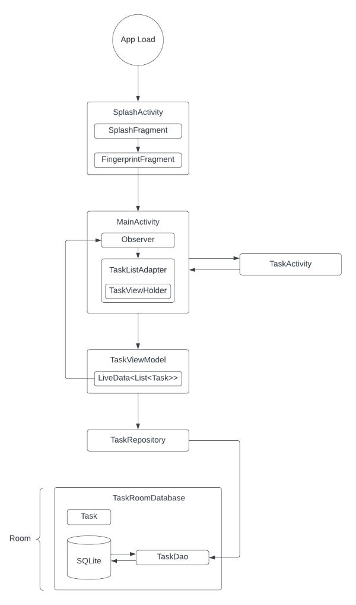

*Fig 1: Architecture component structure*
\
&nbsp;

`SplashActivity`: When the app loads, the **SplashActivity** is called which first displays the splash screen from **SplashFragment** and after animation ends the fingerprint login is displayed form **FingerprintFragment**.

`MainActivity`: It display the tasks in a list using **RecyclerView** and **TaskViewHolder** inside the **TaskListAdapter** which contains the information for displaying one item.There is an **Observer** that observes the **LiveData** from the database and is notified when changes are made.

`TaskActivity`: It adds the new task to the list as per the information entered.

`TaskViewModel`: It provides method for accessing the data layer and it returns **LiveData** so that **MainActivity** can set up the observer.

`LiveData<List<Task>>`: It automatically updates the UI componenets. The **Observer** in **MainActivity** observes the LiveData from the database and is notified when they change.

`Repository`: It manages one or mode data sources by exposing methods for the **TaskViewModel** to interact with the underlying data provider (Room Database).

`Room`: It is a wrapper around and implements a SQLite Database.

`TaskDao`: It validates the SQL queries at compile-time and associated it with a method so that when the **TaskRepository** calls a method, Room can execute the  associated query.

`Task`: It is the entity class that represents a single task.
\
&nbsp;
****
&nbsp;
>## Todo Application
The Todo application is a reminder app that allows the user to maintain their day-to-day tasks in a list. The application is made from scratch using Android Studio with the minimum SDK support for API 16. Following are some of the sample screenshots of the application:

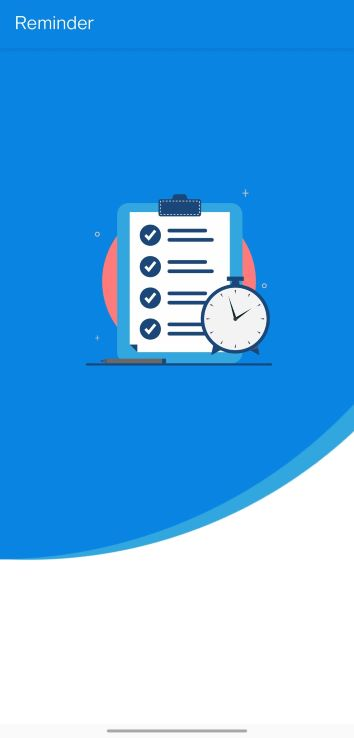

*Fig 2: Splash Screen*
\
&nbsp;

*Fig 3: Fingerprint Login Page*
\
&nbsp;

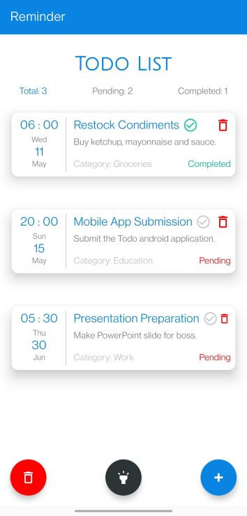

*Fig 4: Home Screen*
\
&nbsp;

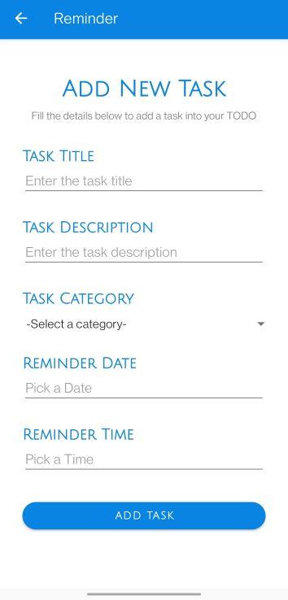

*Fig 5: Add Task Page*
\
&nbsp;

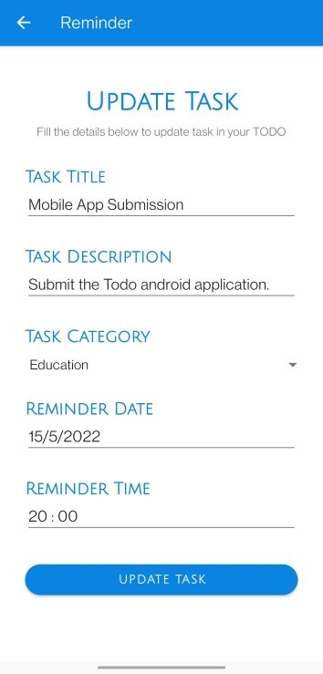

*Fig 6: Update Task Page*
\
&nbsp;

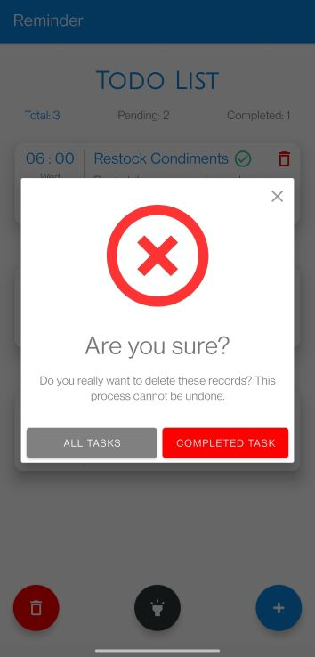

*Fig 7: Delete Task Popup*
\
&nbsp;
****
&nbsp;
>## Application Functionalities
`Basic (CRUD)`

There are some basic Create, Read, Update, Delete (CRUD) functionalities that are must for any Todo application. They have been listed below:
1. Add Task (with validation)
2. Display Tasks
3. Update Task
4. Delete Task
5. Complete Task
\
&nbsp;

`Extra`

Besides the basic requirements, some additional functionalities have been implemented in the application that improves the user experience and security. They are as follows:
1. App Icon and Font
2. Splash Screen
3. Biometric (Fingerprint) Authentication
4. Swipe Gestures (Bidirectional)
5. Task Filter
6. Mass Delete
7. Dark Mode
8. Layout Variants
    - Landscape Variation
    - Tablet Variation 
\
&nbsp;
****
&nbsp;
>## Basic Functionalities
### Add Task
User can add task to the list by clicking on the '+' floating action button which will redirect the user to the add form.

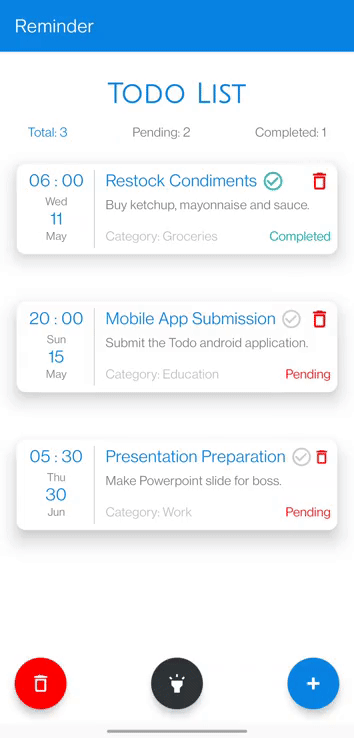

*Fig 8: Add Task*
\
&nbsp;

Some validation checks have also been made which makes sure that all fields are filled before the task can be added.

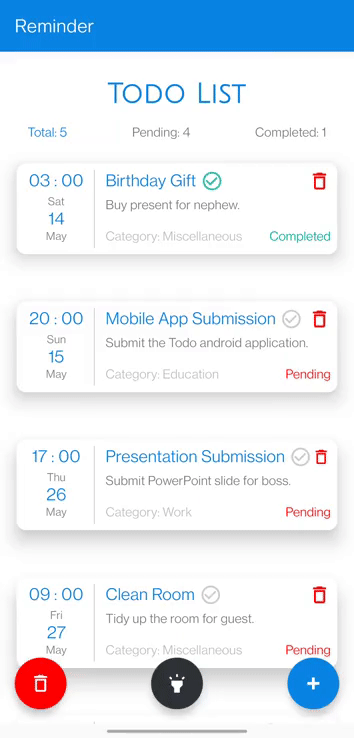

*Fig 9: Add Task Validation*
\
&nbsp;
\
&nbsp;

### Display Tasks
User can view all the tasks in the list by scrolling through the screen.

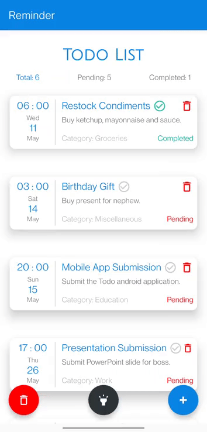

*Fig 10: Display Tasks*
\
&nbsp;
\
&nbsp;

### Update Task
User can update any task simply by tapping on the task title which will redirect the user to update form.

*Fig 11: Update Task*
\
&nbsp;
\
&nbsp;

### Delete Task
User can delete the task by clicking on the trash icon on the top right croner of the task.

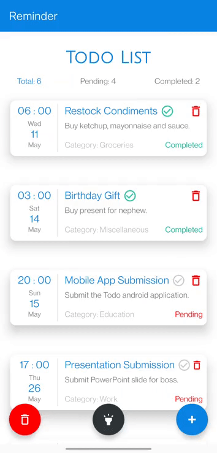

*Fig 12: Delete Task*
\
&nbsp;
\
&nbsp;

### Complete Task
User can complete the task by tapping on the tick icon next to the task title which will light green to indicate completion and also update the status at the bottom right corner.

*Fig 13: Complete Task*
\
&nbsp;
****
&nbsp;
>## Additional Functionalities
### App Icon and Font
The font used for the heading and titles is **julius_sans_one** and the icon that will be used when the application is installed in the device is attached below:

*Fig 14: App Icon*
\
&nbsp;
\
&nbsp;

### Splash Screen
When the app is launched, the following animated splash screen will appear on the device.

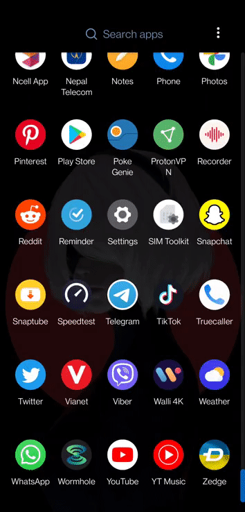

*Fig 15: Splash Screen*
\
&nbsp;
\
&nbsp;

### Biometric (Fingerprint) Authentication
Using the **androidx.biometric** library, fingerprint authentication has been set up which requies the user to scan their fingerprint (registered in the device) in order to use the app functionalities. When user tap on the fingerprint icon, the login prompt will be displayed where they can scan their fingerprint.

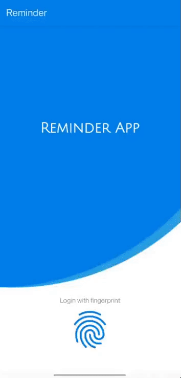

*Fig 16: Fingerprint Authentication Success*
\
&nbsp;

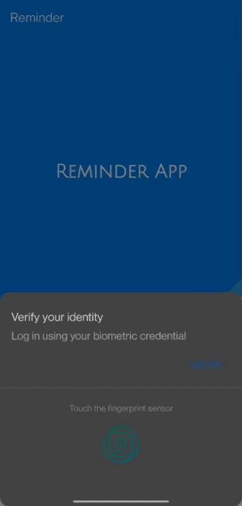

*Fig 17: Fingerprint Authentication Fail*
\
&nbsp;

If the fingerprint is not available/set up, then the user can login using other authentication methods available in the device such as PIN, patterns etc.

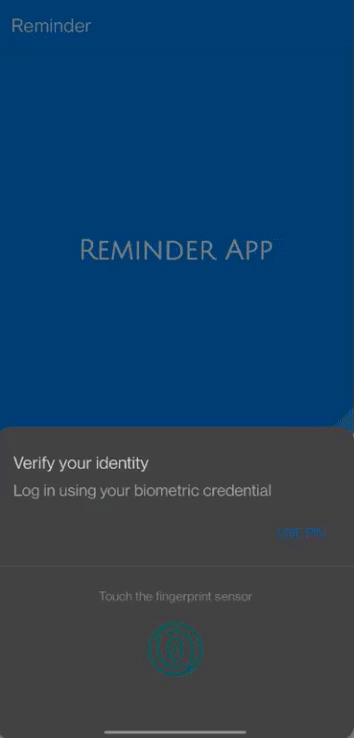

*Fig 18: PIN Authentication*
\
&nbsp;
\
&nbsp;

### Swipe Gesture (Bidirectional)
Swipe gestures have been enabled in the recyclerview using **ItemTouchHelper** class and **RecyclerViewSwipeDecorator** library has been used to add the red and green swipe accent color for visual indication. User can swipe from both directions for different functionalities.

Swiping from the left to right side allows the user to complete the task.

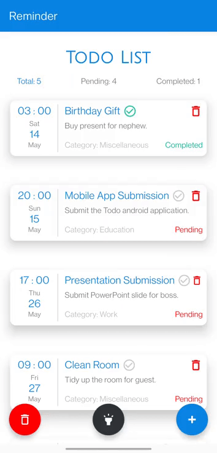

*Fig 19: Right Swipe To Complete Task*
\
&nbsp;

Swiping from the right to left side will delete the task.

*Fig 20: Left Swipe To Delete Task*
\
&nbsp;
\
&nbsp;

### Filter Task
User can filter the task and only view the task of desired status by clicking on the respective status.

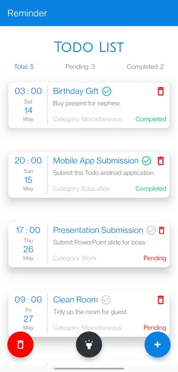

*Fig 21: Filter Task by Status*
\
&nbsp;
\
&nbsp;

### Mass Delete
Deleting task one by one can be very tedious process so to improve the user experience, two options have been added where the user can choose to delete all tasks or delete the completed task only. By clicking on the trash icon at the bottom left corner of the device, the user can access the options via popup.

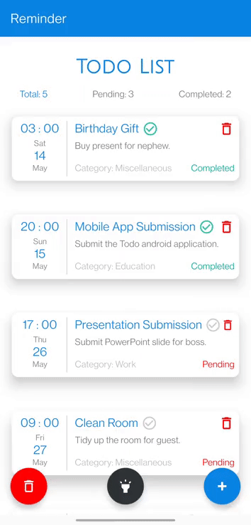

*Fig 22: Delete Completed Tasks*
\
&nbsp;

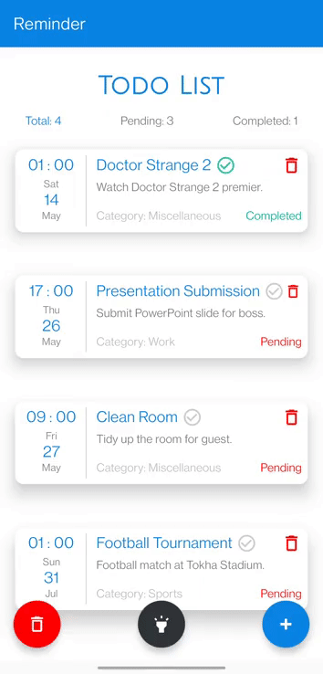

*Fig 23: Delete All Task*
\
&nbsp;
\
&nbsp;

### Dark Mode
Dark mode is one of the most loved and requested feature for any app. Not only is it pleasing to the eye, especially during night time, but it can also save energe consumption on devices with OLED/AMOLED displays. User can toggle the dark mode by tapping on the flashlight icon situated at the middle bottom side of the screen.

*Fig 24: Dark Mode*
\
&nbsp;

Using **SharedPreference** interface, the state of the app is stored so that next time the user opens the app, it will have the same theme as before.

Following are some of the snippets of the dark mode UI:

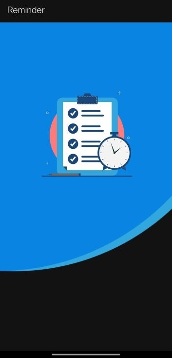

*Fig 25: Splash Screen Dark*
\
&nbsp;

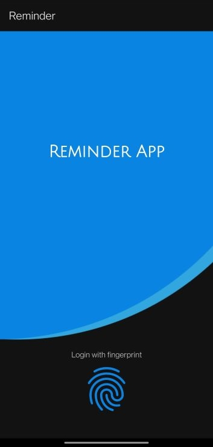

*Fig 26: Fingerprint Login Page Dark*
\
&nbsp;

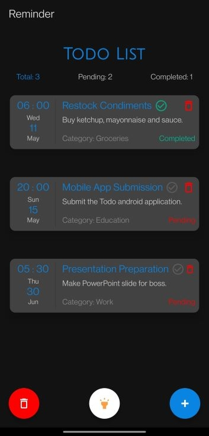

*Fig 27: Home Screen Dark*
\
&nbsp;

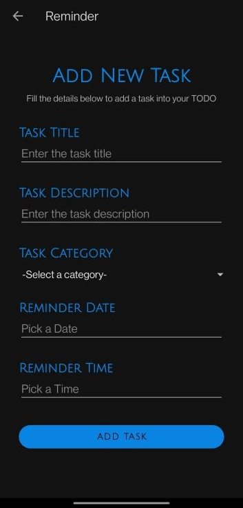

*Fig 28: Add Task Page Dark*
\
&nbsp;

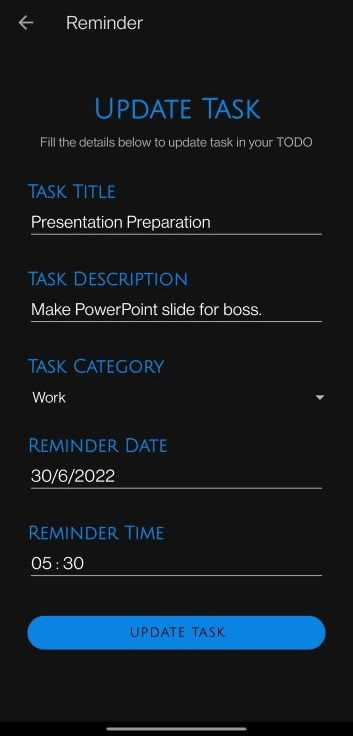

*Fig 29: Update Task Page Dark*
\
&nbsp;

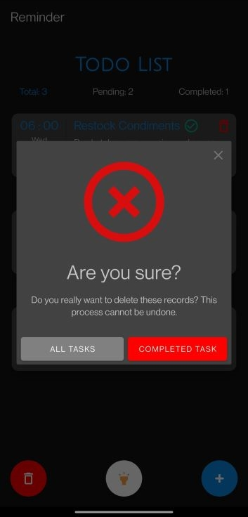

*Fig 30: Delete Task Popup Dark*
\
&nbsp;
\
&nbsp;

### Layout Variants
To make sure that the app fits well in devices of different form factor, different layout variations have been created. i.e., Portrait (default), landscape and tablet.
\
&nbsp;

#### Landscape Variation
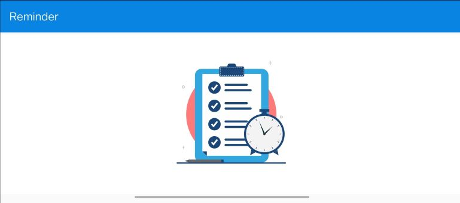

*Fig 31: Splash Screen Landscape*
\
&nbsp;

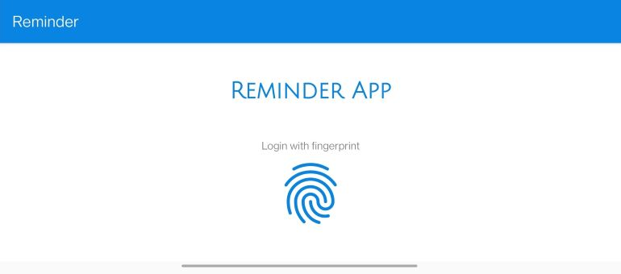

*Fig 32: Fingerprint Login Page Landscape*
\
&nbsp;

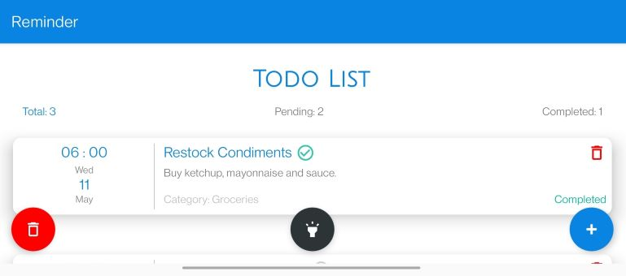

*Fig 33: Home Screen Landscape*
\
&nbsp;

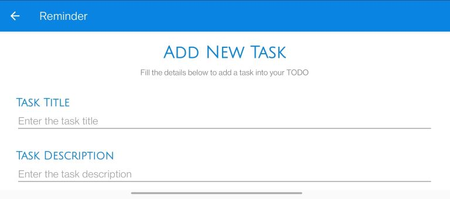

*Fig 34: Add Task Page Landscape*
\
&nbsp;

*Fig 35: Update Task Page Landscape*
\
&nbsp;

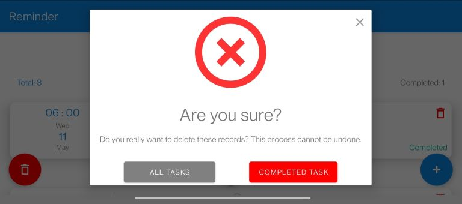

*Fig 36: Delete Task Popup Landscape*
\
&nbsp;
\
&nbsp;

#### Tablet Variation
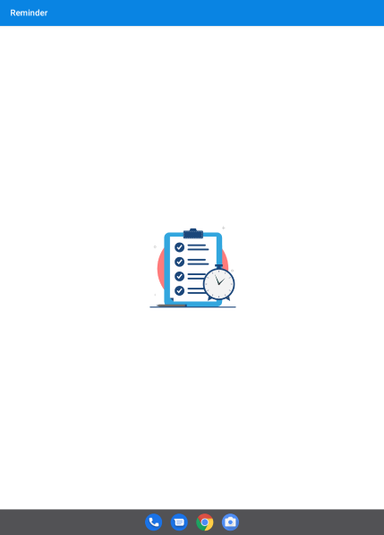

*Fig 37: Splash Screen Tablet*
\
&nbsp;

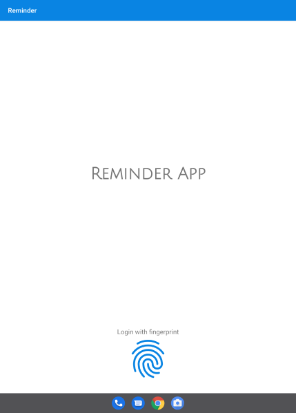

*Fig 38: Fingerprint Login Page Tablet*
\
&nbsp;

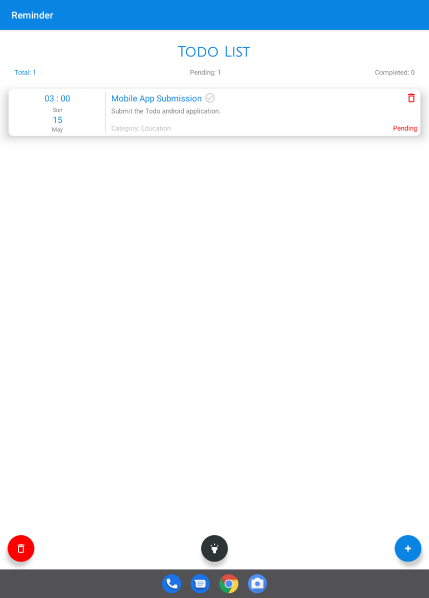

*Fig 39: Home Screen Tablet*
\
&nbsp;

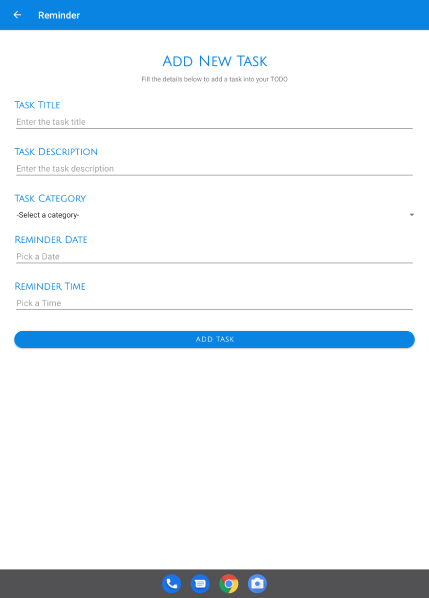

*Fig 40: Add Task Page Tablet*
\
&nbsp;

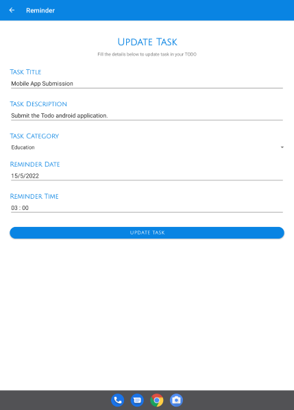

*Fig 41: Update Task Page Tablet*
\
&nbsp;

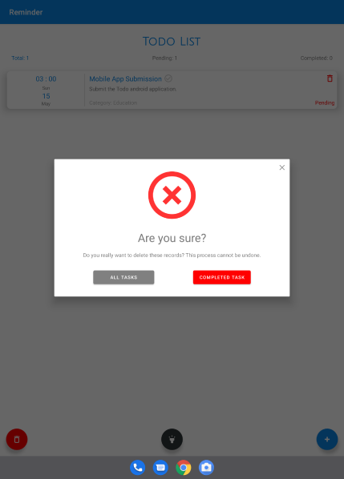

*Fig 42: Delete Task Popup Tablet*